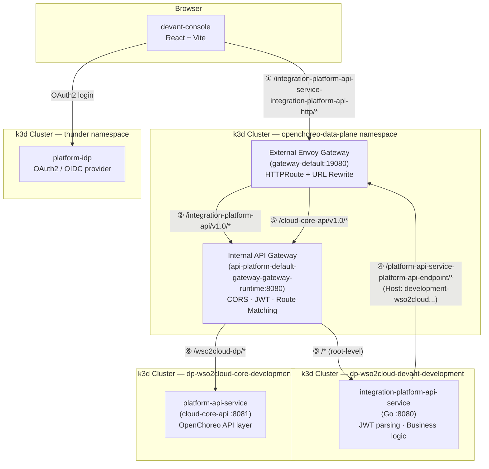
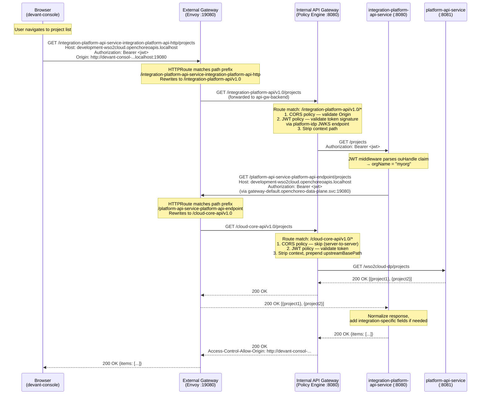
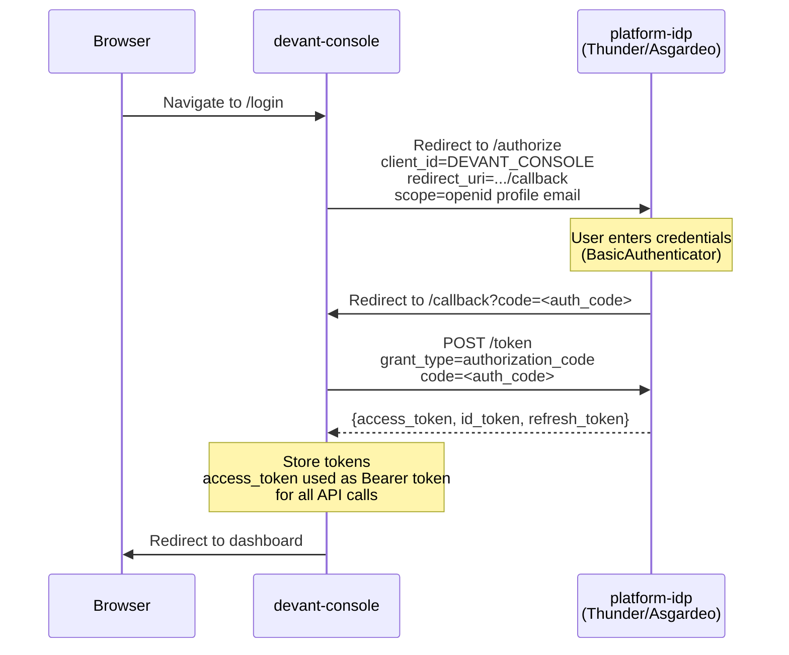
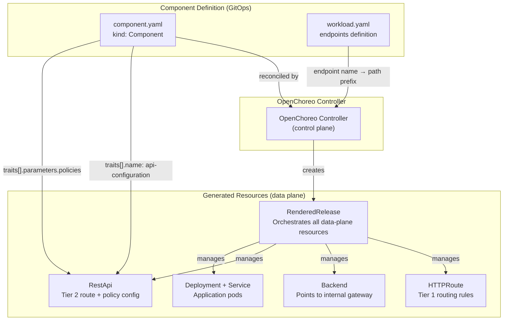
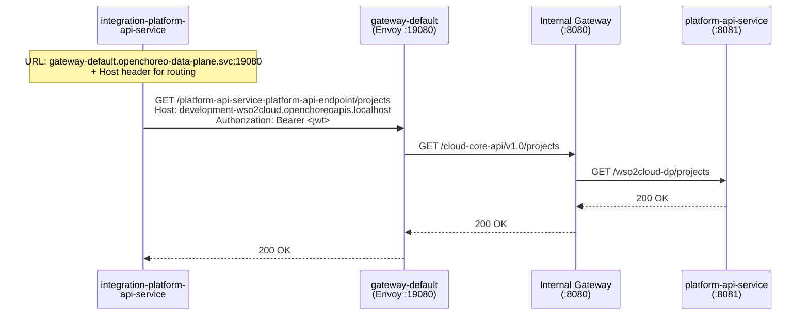

# Devant Platform — Architecture & Request Flow

This document describes the end-to-end architecture of the Devant integration platform, covering how browser requests travel from the **devant-console** frontend through the **two-tier gateway** to the **integration-platform-api-service** and ultimately to the **OpenChoreo control plane**.

## High-Level Architecture

```
┌─────────────────────────────────────────────────────────────────────────────────────┐
│                                    Browser                                         │
│                                                                                    │
│  devant-console (React/Vite)                                                       │
│  http://devant-consol-devant-consol-development-wso2cloud-87640b2b                  │
│         .openchoreoapis.localhost:19080                                             │
└──────────────────────────────────┬──────────────────────────────────────────────────┘
                                   │  HTTP (cross-origin or same-origin via nginx proxy)
                                   ▼
┌─────────────────────────────────────────────────────────────────────────────────────┐
│                        Tier 1 — External Envoy Gateway                             │
│                       (gateway-default, port 19080)                                 │
│                                                                                    │
│  • Terminates external traffic                                                     │
│  • Matches HTTPRoute rules by hostname + path prefix                               │
│  • Rewrites URL prefix before forwarding to backend                                │
│  • Does NOT enforce auth or CORS — delegates to Tier 2                             │
└──────────────────────────────────┬──────────────────────────────────────────────────┘
                                   │  Rewritten path
                                   ▼
┌─────────────────────────────────────────────────────────────────────────────────────┐
│                   Tier 2 — Internal API Gateway (Policy Engine)                     │
│           (api-platform-default-gateway-gateway-runtime, port 8080)                 │
│                                                                                    │
│  • Matches routes by context path (e.g. /integration-platform-api/v1.0/*)          │
│  • Enforces policies: CORS, JWT authentication                                     │
│  • Strips the context path before forwarding to upstream service                   │
│  • Routes configured via RestApi CRD (created by api-configuration ClusterTrait)   │
└──────────────────────────────────┬──────────────────────────────────────────────────┘
                                   │  Path stripped to root (e.g. /projects)
                                   ▼
┌─────────────────────────────────────────────────────────────────────────────────────┐
│              integration-platform-api-service (Go, port 8080)                       │
│                                                                                    │
│  • Receives requests at root-level paths (/projects, /health, etc.)                │
│  • Parses JWT claims (ouHandle) to determine org context                           │
│  • Calls platform-api-service for OpenChoreo CRUD operations                       │
│  • Adds custom business logic for integration-specific APIs                        │
└──────────────────────────────────┬──────────────────────────────────────────────────┘
                                   │  Internal HTTP (via Tier 1 gateway + Host header)
                                   ▼
┌─────────────────────────────────────────────────────────────────────────────────────┐
│           platform-api-service (cloud-core-api, port 8081)                          │
│                                                                                    │
│  • OpenChoreo control plane API layer                                              │
│  • Manages projects, components, environments, etc.                                │
│  • Upstream base path: /wso2cloud-dp                                               │
└─────────────────────────────────────────────────────────────────────────────────────┘
```

## Component Overview



## Request Flow — Sequence Diagram

### Browser → integration-platform-api-service → platform-api-service



### OAuth2 Authentication Flow



## Two-Tier Gateway Architecture

### Tier 1 — External Envoy Gateway

| Property | Value |
|----------|-------|
| Service | `gateway-default` |
| Namespace | `openchoreo-data-plane` |
| Ports | `19080` (HTTP), `19443` (HTTPS) |
| Type | `LoadBalancer` (LB IP: `172.18.0.3` in k3d) |
| Managed by | Envoy Gateway (via `Gateway` CRD) |

**Responsibilities:**
- Terminates external HTTP/HTTPS traffic
- Routes requests based on `HTTPRoute` rules (hostname + path prefix)
- Rewrites URL prefixes before forwarding to the Backend resource
- Does **not** enforce authentication or CORS

**HTTPRoute Rules:**

| Path Prefix | Rewrites To | Backend |
|-------------|-------------|---------|
| `/integration-platform-api-service-integration-platform-api-http` | `/integration-platform-api/v1.0` | `integration-platform-api-service-api-gw-backend` |
| `/platform-api-service-platform-api-endpoint` | `/cloud-core-api/v1.0` | `platform-api-service-api-gw-backend` |

The path prefix is auto-generated by the OpenChoreo controller from: `/{component-name}-{endpoint-name}`, where endpoint name comes from `workload.yaml`.

All Backend resources point to the same internal API gateway:

```
api-platform-default-gateway-gateway-runtime.openchoreo-data-plane:8080
```

### Tier 2 — Internal API Gateway (Policy Engine)

| Property | Value |
|----------|-------|
| Service | `api-platform-default-gateway-gateway-runtime` |
| Namespace | `openchoreo-data-plane` |
| Port | `8080` |
| Config port | `9002` |
| Managed by | `api-platform-default-gateway-controller` |

**Responsibilities:**
- Matches incoming requests by context path
- Enforces policies (CORS, JWT authentication)
- Strips the context path and forwards to the upstream service
- Optionally prepends `upstreamBasePath` before forwarding

**Route Configuration (via RestApi CRD):**

| Context Path | Upstream URL | Policies |
|--------------|-------------|----------|
| `/integration-platform-api/v1.0/*` | `http://integration-platform-api-service.dp-wso2cloud-devant-development-0bea7a4d:8080` | cors (v0), jwt-auth (v0) |
| `/cloud-core-api/v1.0/*` | `http://platform-api-service.dp-wso2cloud-core-development-54e3d6ff:8081/wso2cloud-dp` | cors (v0), jwt-auth (v0) |

**Path transformation example:**

```
Browser request:
  /integration-platform-api-service-integration-platform-api-http/projects

After Tier 1 (External Gateway) URL rewrite:
  /integration-platform-api/v1.0/projects

After Tier 2 (Internal Gateway) context strip:
  /projects  →  forwarded to integration-platform-api-service:8080

After Tier 2 for platform-api-service (with upstreamBasePath):
  /cloud-core-api/v1.0/projects  →  /wso2cloud-dp/projects  →  forwarded to platform-api-service:8081
```

## CORS Policy Configuration

CORS is enforced **exclusively at the Internal API Gateway** (Tier 2) via the `api-configuration` ClusterTrait. Neither the Go backend nor the frontend set CORS headers.

### integration-platform-api-service CORS Policy

```yaml
# Source: component.yaml → traits → api-configuration → policies
- name: cors
  version: v0
  params:
    allowedOrigins:
      - "http://devant-consol-devant-consol-development-wso2cloud-87640b2b.openchoreoapis.localhost:19080"
      - "http://localhost:3000"     # nginx container port (production)
      - "http://localhost:3001"     # Vite dev server port
    allowCredentials: true
    allowedHeaders:
      - Authorization
      - Content-Type
      - Accept
      - Origin
    allowedMethods:
      - GET
      - POST
      - PUT
      - DELETE
      - PATCH
      - OPTIONS
```

### platform-api-service CORS Policy

```yaml
- name: cors
  version: v0
  params:
    allowedOrigins:
      - "http://cloud-console-cloud-console-development-wso2cloud-3877df74.openchoreoapis.localhost:19080"
      - "http://sample-consol-sample-consol-development-wso2cloud-eb8e8c84.openchoreoapis.localhost:19080"
      - "http://devant-consol-devant-consol-development-wso2cloud-87640b2b.openchoreoapis.localhost:19080"
      - "http://localhost:3000"
    allowCredentials: true
    allowedHeaders:
      - Authorization
      - Content-Type
      - Accept
      - Origin
    allowedMethods:
      - GET
      - POST
      - PUT
      - DELETE
      - PATCH
      - OPTIONS
```

### platform-idp CORS (Separate Config)

Platform-idp manages its own CORS via application config (`corsAllowedOrigins` in release binding), not the gateway trait. It includes all console origins plus localhost dev ports.

### Why No CORS in Application Code

The devant-console uses two strategies to avoid cross-origin issues at the application layer:

1. **Production (in-cluster):** nginx reverse proxy at `/integration-platform-api-service/*` forwards to the gateway server-side. The browser sees same-origin requests.
2. **Local development:** Vite dev server proxy does the same (`vite.config.ts` → `proxy`).

Even when the release binding overrides `VITE_CORE_DP_API_BASE_URL` with an absolute gateway URL (making requests cross-origin from the browser), the gateway's CORS policy handles the `Access-Control-*` response headers. The Go backend never sets CORS headers, avoiding duplicate header conflicts.

## OpenChoreo Resource Model



### Key Resources

| Resource | Purpose | Created By |
|----------|---------|------------|
| `Component` | Declares the service, its workflow, and traits | Developer (GitOps) |
| `ReleaseBinding` | Environment-specific config overrides (env vars, files) | Developer (GitOps) |
| `RenderedRelease` | Reconciled state combining Component + ReleaseBinding | OpenChoreo controller |
| `HTTPRoute` | Tier 1 gateway routing (path prefix → backend) | `renderedrelease-controller` |
| `Backend` | Points HTTPRoute to the internal API gateway | `renderedrelease-controller` |
| `RestApi` | Tier 2 gateway config (context path, policies, upstream) | `renderedrelease-controller` |
| `ClusterTrait` (`api-configuration`) | Template for generating RestApi from component traits | Platform team |

## Service-to-Service Communication

The integration-platform-api-service calls platform-api-service **through the gateway** (not pod-to-pod) for two reasons:

1. **NetworkPolicy:** Cross-namespace pod communication is blocked. The gateway namespace has the required network access.
2. **DNS resolution:** The hostname `development-wso2cloud.openchoreoapis.localhost` does not resolve inside cluster pods (`.localhost` is not routable). The service uses the internal gateway service URL instead:

```
# What the Go service calls (env: PLATFORM_API_SERVICE_BASE_URL)
http://gateway-default.openchoreo-data-plane.svc.cluster.local:19080
    /platform-api-service-platform-api-endpoint

# With explicit Host header (env: PLATFORM_API_SERVICE_HOST)
Host: development-wso2cloud.openchoreoapis.localhost
```

The Host header is required because the Envoy gateway uses it to match HTTPRoute rules. Without it, the gateway cannot route the request.



## Configuration Reference

### integration-platform-api-service Environment Variables

| Variable | Source | Value |
|----------|--------|-------|
| `PLATFORM_API_SERVICE_BASE_URL` | ReleaseBinding | `http://gateway-default.openchoreo-data-plane.svc.cluster.local:19080/platform-api-service-platform-api-endpoint` |
| `PLATFORM_API_SERVICE_HOST` | ReleaseBinding | `development-wso2cloud.openchoreoapis.localhost` |
| `LOG_LEVEL` | ReleaseBinding | `info` |

### devant-console Runtime Configuration (env-config.js)

| Variable | Value |
|----------|-------|
| `VITE_CORE_DP_API_BASE_URL` | `http://development-wso2cloud.openchoreoapis.localhost:19080/integration-platform-api-service-integration-platform-api-http` |
| `VITE_PLATFORM_IDP_URL` | `http://platform-idp.127.0.0.1.nip.io:19080` |
| `VITE_THUNDER_CLIENT_ID` | `DEVANT_CONSOLE` |
| `VITE_THUNDER_REDIRECT_URI` | `http://devant-consol-devant-consol-development-wso2cloud-87640b2b.openchoreoapis.localhost:19080/callback` |

### Kubernetes Namespaces

| Namespace | Contents |
|-----------|----------|
| `openchoreo-data-plane` | External gateway, internal API gateway, gateway controllers |
| `dp-wso2cloud-devant-development-0bea7a4d` | integration-platform-api-service pods, HTTPRoute, Backend, RestApi |
| `dp-wso2cloud-core-development-54e3d6ff` | platform-api-service pods, HTTPRoute, Backend, RestApi |
| `wso2cloud` | Component definitions, ReleaseBindings, RenderedReleases |

## Troubleshooting

### Common 404 Causes

1. **RestApi not Programmed** — Check `kubectl get restapi <name> -n <ns> -o jsonpath='{.status.conditions}'`. If `Programmed` is `False`, the internal gateway rejected the config (e.g. invalid policy version).

2. **Go service expects wrong path** — The internal gateway strips the context path. The service must register routes at root level (`/projects`), not under the context path (`/integration-platform-api/v1.0/projects`).

3. **Missing Host header (service-to-service)** — Calls through the external gateway require the correct `Host` header for HTTPRoute matching. Without it, the gateway returns 404.

### Common CORS Errors

1. **Missing origin in CORS policy** — The browser's `Origin` header must match an entry in the `allowedOrigins` list in the component's `api-configuration` trait.

2. **Duplicate CORS headers** — If both the gateway and the application set `Access-Control-*` headers, the browser may reject the response. The application must not set CORS headers when the gateway handles them.

### Checking Gateway Routes

```bash
# Verify RestApi is deployed and accepted
kubectl get restapi -A

# Check RestApi status
kubectl get restapi <name> -n <namespace> -o jsonpath='{.status.conditions}' | python3 -m json.tool

# Verify HTTPRoute exists
kubectl get httproute -A | grep integration-platform

# Check the Backend target
kubectl get backend -A -o json | python3 -c "
import json, sys
for item in json.load(sys.stdin)['items']:
    print(f\"{item['metadata']['namespace']}/{item['metadata']['name']}: {item['spec']}\")
"
```
